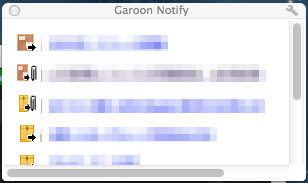

GaroonNotify
============
とある会社のGaroon専用通知アプリです。

やってることはGaroonにアクセスしてパースして監視対象があれば更新通知するだけです。
トップページは全社員共通だったはずなのでみんな使えるかなと。

なんかモザイクって怪しいなぁ。。

使い方
------

### 導入
1. git cloneしてリポジトリを持ってきます。
2. ガルーンにログインします。
3. 拡張機能を取り込む。引用：<http://dev.screw-axis.com/doc/chrome_extensions/tutorials/getting_started/>
  1. レンチのアイコンをした設定メニューを開き、“拡張機能” を選んで拡張機能管理画面を呼び出す。
 2. もし “デベロッパー モード” の横に + の記号があれば、そこをクリックする。すると + が – に変わり、幾つかのボタンが表示される。
 3. 表示された “パッケージ化されていない拡張機能を読み込みます…” をクリックする。
 4. ダイアログが表示されるので、作成したフォルダを指定して OK をクリックする。
4. 設定
  1. options.htmlが開きます。自動的に開かない場合は “拡張機能” から開いてください。
  2. GaroonトップページのURLを入力してSaveします。
  3. 通知が表示されればOKです。（何も更新がない場合は通知されません）
